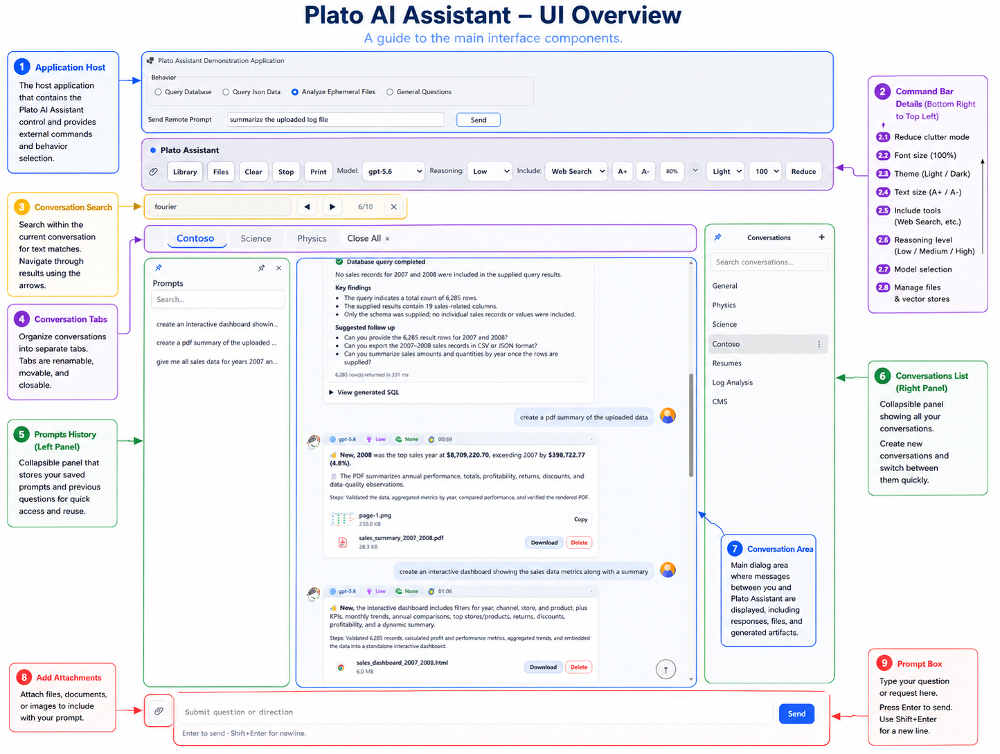

# Plato AI Assistant for .NET 10

A demonstration application for Plato AI Assistant,
a drop-in ChatGPT-like AI Assistant control for .NET 10.

## Features

- OpenAI and Azure OpenAI
- Streaming conversations
- Conversation history
- File attachments
- Generated artifacts
- Vector stores
- Document analysis
- Model and reasoning configuration
- Host-initiated prompts
- Headless operation

## Installation

Install Plato AI Assistant from NuGet:

dotnet add package Plato.AI.Assistant

## Demo Video

https://youtu.be/d1rUOVHB_2Q

## NuGet

https://www.nuget.org/packages/Plato.AI.Assistant

## Documentation

https://www.cpr-tech.com/Help/PlatoAIAssistant
